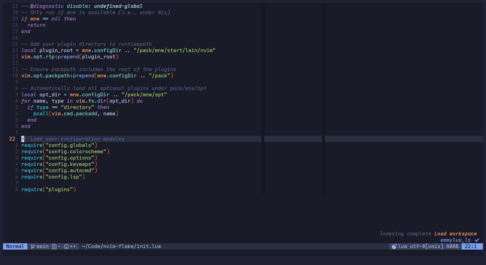
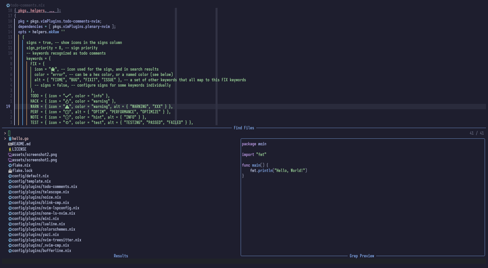

# 🌟 Neovim Configuration

Welcome to my Neovim configuration! This setup leverages the power of [nix-community/nixvim](https://github.com/nix-community/nixvim) to provide a de
clarative and reproducible Neovim environment using Nix. Enjoy a consistent and highly customizable text editing experience!

## 📋 Table of Contents

1. [Screenshots](#-screenshots)
2. [Introduction](#-introduction)
3. [Usage](#-usage)
4. [Inspiration](#-inspiration)

## 📷 Screenshots

<div style="display: flex; gap: 10px; justify-content: center;">
  
  
</div>

## 🌟 Introduction

This repository contains my personal Neovim configuration managed with Nix. By using Nix, I ensure that my setup is consistent across different machines and easy to update or roll back.

## 🛠 Usage

To test the Neovim configuration simply run the following command

```sh
nix run .
```

## 🤝 Contributing

Contributions are welcome! Feel free to open issues or pull requests if you have suggestions or improvements.

## 🌙 Inspiration

This configuration is inspired by:

- [Kickstart.nvim](https://github.com/nvim-lua/kickstart.nvim)
- [Khaneliman's config](https://github.com/khaneliman/khanelinix/tree/main/modules/home/programs/terminal/editors/neovim)
- [Ruixi-rebirth's config](https://github.com/Ruixi-rebirth/nvim-flake)
- [Traxys's config](https://github.com/traxys/Nixfiles/tree/master/neovim)
