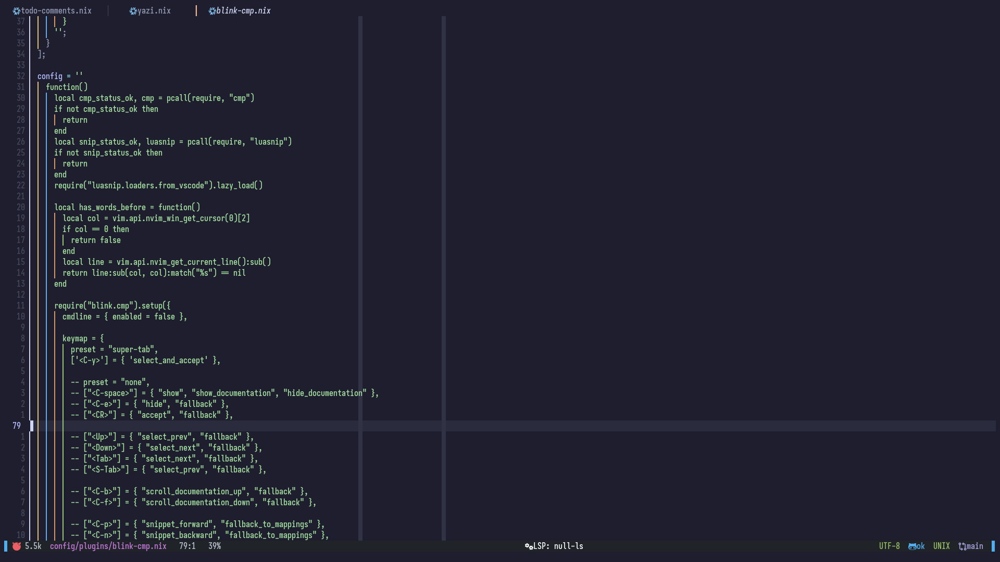

# 🌟 Neovim Configuration

Welcome to my Neovim configuration! This setup leverages the power of [mnw](https://github.com/Gerg-L/mnw/) to provide a declarative and reproducible Neovim environment using Nix. Enjoy a consistent and highly customizable text editing experience!

## 📋 Table of Contents

1. [Screenshots](#-screenshots)
2. [Introduction](#-introduction)
3. [Usage](#-usage)
4. [Inspiration](#-inspiration)

## 📷 Screenshots

<details>
<summary>Click to view screenshots</summary>

<div style="display: flex; gap: 10px; justify-content: center;">
  
  
</div>

</details>

## 🌟 Introduction

This repository contains my personal Neovim configuration managed with Nix. By using [mnw](https://github.com/Gerg-L/mnw/), I ensure that my setup is consistent across different machines and easy to update or roll back.

## 🛠 Usage

To test the Neovim configuration simply run the following command:

```sh
nix run .
```

## 🤝 Contributing

Contributions are welcome! Feel free to open issues or pull requests if you have suggestions or improvements.

## 🌙 Inspiration

This configuration is inspired by:

- [Kickstart.nvim](https://github.com/nvim-lua/kickstart.nvim)
- [Gerg's config](https://github.com/Gerg-L/nvim-flake/)
